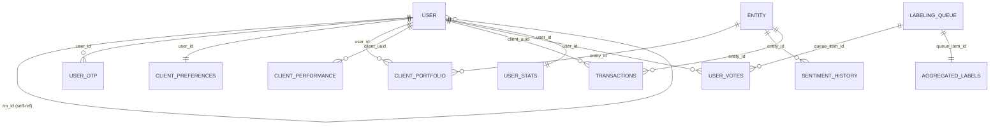

# SentiFinance Database Schema

This document provides a comprehensive overview of all database tables, their relationships, and data types used in the SentiFinance application.

## Database Technology
- **Database**: PostgreSQL 12+
- **ORM**: SQLAlchemy with Flask-Migrate (Alembic)
- **UUID**: Used as primary keys for all main entities

## Table Overview

| Table | Purpose | Key Relationships |
|-------|---------|-------------------|
| [user](#user) | User accounts (Clients & RMs) | Self-referential for RM-Client |
| [user_otp](#user_otp) | OTP codes for authentication | → user |
| [client_preferences](#client_preferences) | Risk tolerance & investment preferences | → user |
| [entity](#entity) | Companies/stocks with sentiment data | Many portfolio relationships |
| [news](#news) | News articles with sentiment analysis | Many entity relationships |
| [sentiment_history](#sentiment_history) | Historical sentiment tracking | → entity |
| [client_portfolio](#client_portfolio) | Current holdings per client | → user, entity |
| [client_performance](#client_performance) | Daily performance tracking | → user |
| [transactions](#transactions) | All financial transactions | → user, entity |
| [labeling_queue](#labeling_queue) | Active learning ML queue | Many votes |
| [user_votes](#user_votes) | Human sentiment labels | → labeling_queue, user |
| [aggregated_labels](#aggregated_labels) | Consensus sentiment labels | → labeling_queue |
| [user_stats](#user_stats) | Labeling accuracy statistics | → user |
| [model_runs](#model_runs) | ML model deployment tracking | Standalone |

---

## Core Tables

### user
**Purpose**: User accounts for both clients and relationship managers

```sql
CREATE TABLE "user" (
    id UUID PRIMARY KEY DEFAULT uuid_generate_v4(),
    username VARCHAR(80) NOT NULL UNIQUE,
    email VARCHAR(120) NOT NULL UNIQUE,
    first_name VARCHAR(50) NOT NULL,
    last_name VARCHAR(50) NOT NULL,
    role user_role NOT NULL,  -- ENUM: 'CLIENT' | 'RELATIONSHIP_MANAGER'
    rm_id UUID REFERENCES "user"(id),  -- Self-referential for client → RM
    created_at TIMESTAMP DEFAULT CURRENT_TIMESTAMP
);
```

**Key Features**:
- Self-referential relationship (clients assigned to RMs)
- Role-based access control
- Passwordless authentication (uses OTP)

**Relationships**:
- One-to-many: RM → Clients (`rm_id` foreign key)
- One-to-many: User → OTPs
- One-to-one: User → Preferences
- One-to-many: User → Portfolio positions
- One-to-many: User → Transactions

---

### user_otp
**Purpose**: One-time passwords for passwordless authentication

```sql
CREATE TABLE user_otp (
    id UUID PRIMARY KEY DEFAULT uuid_generate_v4(),
    user_id UUID NOT NULL REFERENCES "user"(id),
    otp_code VARCHAR(6) NOT NULL,
    expires_at TIMESTAMP NOT NULL,
    is_used BOOLEAN DEFAULT FALSE NOT NULL,
    created_at TIMESTAMP DEFAULT CURRENT_TIMESTAMP
);
```

**Key Features**:
- 6-digit OTP codes
- 24-hour expiration window
- Single-use tokens (marked as used after verification)
- Auto-invalidation of old OTPs when new ones are created

---

### entity
**Purpose**: Companies/stocks tracked for sentiment analysis

```sql
CREATE TABLE entity (
    id UUID PRIMARY KEY DEFAULT uuid_generate_v4(),
    name VARCHAR(100) NOT NULL UNIQUE,
    ticker VARCHAR(20),
    summary TEXT,
    sentiment_score FLOAT,         -- Aggregated sentiment (-100 to +100)
    finbert_score FLOAT,           -- FinBERT model score
    gemini_score FLOAT,            -- Gemini AI score
    open_ai_score FLOAT,           -- OpenAI model score
    confidence_score FLOAT,        -- Confidence in sentiment (0-1)
    time_decay FLOAT,              -- Time-weighted decay factor
    simple_average FLOAT,          -- Simple average of model scores
    classification VARCHAR(50),     -- Sentiment classification (bullish/bearish/neutral)
    asset_type VARCHAR(20),        -- Type of asset
    sector VARCHAR[]               -- Array of GICS sectors
);
```

**Key Features**:
- Multi-model sentiment scoring
- Sector classification using arrays
- Time-decay weighted scoring
- Confidence metrics for recommendations

---

### news
**Purpose**: News articles with comprehensive sentiment analysis

```sql
CREATE TABLE news (
    id UUID PRIMARY KEY DEFAULT uuid_generate_v4(),
    publisher VARCHAR(100),
    description TEXT,
    published_date TIMESTAMP NOT NULL,
    title VARCHAR(255) NOT NULL,
    url TEXT NOT NULL UNIQUE,
    content TEXT,                  -- Full article text
    scraped_at TIMESTAMP,         -- When article was processed
    entities VARCHAR[],            -- Related tickers/entities
    score FLOAT,                   -- Primary sentiment score
    finbert_score FLOAT,          -- FinBERT model score
    second_model_score FLOAT,     -- Gemini score
    third_model_score FLOAT,      -- OpenAI score
    sentiment VARCHAR(50),        -- Classification
    summary TEXT,                 -- AI-generated summary
    tags VARCHAR[],               -- Article tags
    confidence FLOAT,             -- Confidence in analysis
    agreement_rate FLOAT,         -- Model agreement rate
    company_names VARCHAR[],      -- Extracted company names
    regions VARCHAR[],            -- Geographic regions
    sectors VARCHAR[],            -- Business sectors
    shap JSON,                    -- SHAP explanation data
    shapUrl TEXT                  -- Azure Blob URL for SHAP HTML
);
```

**Key Features**:
- Multi-model sentiment analysis with SHAP explainability
- Entity extraction (companies, regions, sectors)
- AI-generated summaries
- Model agreement tracking
- SHAP visualizations stored in Azure Blob Storage

---

## Financial Tables

### client_preferences
**Purpose**: Investment preferences and risk tolerance settings

```sql
CREATE TABLE client_preferences (
    id UUID PRIMARY KEY DEFAULT uuid_generate_v4(),
    user_id UUID NOT NULL UNIQUE REFERENCES "user"(id),
    holding FLOAT,
    overall_pl FLOAT,
    stop_loss_tolerance FLOAT,
    risk_cap VARCHAR,              -- 'Zero', 'Medium', 'Moderate', 'High', 'Very High'
    sectors VARCHAR[],             -- Preferred sectors
    max_single_position_percent FLOAT DEFAULT 15.0,
    max_sector_allocation_percent FLOAT DEFAULT 40.0,
    min_cash_reserve_percent FLOAT DEFAULT 10.0,
    created_at TIMESTAMP DEFAULT CURRENT_TIMESTAMP,
    updated_at TIMESTAMP DEFAULT CURRENT_TIMESTAMP
);
```

**Key Features**:
- Risk-based default allocation limits
- Sector preference filtering
- Position size and concentration controls
- Cash reserve requirements

---

### client_portfolio
**Purpose**: Current holdings and position tracking

```sql
CREATE TABLE client_portfolio (
    user_id UUID NOT NULL REFERENCES "user"(id),
    entity_id UUID NOT NULL REFERENCES entity(id),
    qty INTEGER NOT NULL,

    -- Cost basis and investment tracking
    average_cost_basis FLOAT,
    total_invested FLOAT,
    first_purchase_date TIMESTAMP,
    last_transaction_date TIMESTAMP,

    -- Current market data
    current_price FLOAT,
    current_market_value FLOAT,
    unrealized_pnl FLOAT,
    unrealized_pnl_percent FLOAT,
    portfolio_allocation_percent FLOAT,

    created_at TIMESTAMP DEFAULT CURRENT_TIMESTAMP,
    updated_at TIMESTAMP DEFAULT CURRENT_TIMESTAMP,

    PRIMARY KEY (user_id, entity_id)
);
```

**Key Features**:
- Composite primary key (user + entity)
- Real-time P&L calculation
- Portfolio allocation tracking
- Cost basis and performance metrics

---

### transactions
**Purpose**: All financial transactions (deposits, trades, etc.)

```sql
CREATE TABLE transactions (
    txn_uuid UUID PRIMARY KEY DEFAULT uuid_generate_v4(),
    client_uuid UUID NOT NULL REFERENCES "user"(id),
    datetime TIMESTAMP NOT NULL DEFAULT CURRENT_TIMESTAMP,
    source VARCHAR(100) NOT NULL,
    type transaction_type NOT NULL,    -- 'DEPOSIT', 'WITHDRAWAL', 'DIVIDEND', 'BUY', 'SELL'
    currency currency_enum NOT NULL,   -- 'USD', 'SGD', 'EUR', 'GBP', 'JPY'
    amount NUMERIC(15, 2) NOT NULL,
    desc TEXT,

    -- Stock transaction fields
    entity_id UUID REFERENCES entity(id),
    quantity FLOAT,
    price_per_share FLOAT
);
```

**Key Features**:
- Support for multiple transaction types
- Multi-currency support
- Stock-specific fields (quantity, price)
- Audit trail for all financial activity

---

### client_performance
**Purpose**: Daily performance tracking

```sql
CREATE TABLE client_performance (
    client_uuid UUID NOT NULL REFERENCES "user"(id),
    datetime TIMESTAMP NOT NULL DEFAULT CURRENT_TIMESTAMP,
    daily_performance DOUBLE PRECISION NOT NULL,

    PRIMARY KEY (client_uuid, datetime)
);
```

**Key Features**:
- Time-series performance data
- Composite primary key for efficient time-based queries

---

## Analytics & ML Tables

### sentiment_history
**Purpose**: Historical sentiment tracking for entities

```sql
CREATE TABLE sentiment_history (
    id UUID PRIMARY KEY DEFAULT uuid_generate_v4(),
    entity_id UUID NOT NULL REFERENCES entity(id),
    date DATE NOT NULL,
    sentiment_score FLOAT NOT NULL
);
```

**Key Features**:
- Daily sentiment score snapshots
- Enables trend analysis and historical charting

---

### labeling_queue
**Purpose**: Active learning queue for model improvement

```sql
CREATE TABLE labeling_queue (
    id SERIAL PRIMARY KEY,
    news_id VARCHAR(100),
    text TEXT NOT NULL,
    finbert_score FLOAT NOT NULL,
    llm_score FLOAT NOT NULL,
    model_type VARCHAR(20) NOT NULL,       -- 'openai', 'gemini', 'user_feedback'
    disagreement_score FLOAT NOT NULL,
    uncertainty_score FLOAT NOT NULL,
    sampling_reason VARCHAR(100) NOT NULL,
    priority INTEGER NOT NULL,             -- 1=highest, 5=lowest
    status queue_status DEFAULT 'pending', -- 'pending', 'in_progress', 'completed', 'skipped'

    -- Enhanced sentiment metadata
    features_json JSON,
    feature_names_json JSON,
    model_weights JSON,                    -- {"finbert": 0.75, "second_model": 0.25}
    integration_reason VARCHAR(100),
    finbert_confidence FLOAT,
    llm_confidence FLOAT,
    both_confident BOOLEAN,
    is_financial_heavy BOOLEAN,
    final_combined_score FLOAT,

    created_at TIMESTAMP DEFAULT CURRENT_TIMESTAMP,
    updated_at TIMESTAMP DEFAULT CURRENT_TIMESTAMP
);
```

**Key Features**:
- Priority-based queuing for human labeling
- Model disagreement detection
- Feature storage for ML training
- Active learning sample selection

---

### user_votes
**Purpose**: Human sentiment labels for model training

```sql
CREATE TABLE user_votes (
    id SERIAL PRIMARY KEY,
    queue_item_id INTEGER NOT NULL REFERENCES labeling_queue(id) ON DELETE CASCADE,
    user_id UUID NOT NULL REFERENCES "user"(id),
    vote sentiment_vote NOT NULL,          -- 'bullish', 'bearish', 'neutral'
    vote_time TIMESTAMP DEFAULT CURRENT_TIMESTAMP,
    session_info JSON,
    news_id VARCHAR(100)
);
```

**Key Features**:
- Links human feedback to ML training queue
- Session tracking for quality control
- Cascade deletion with queue items

---

### aggregated_labels
**Purpose**: Consensus sentiment labels from multiple human votes

```sql
CREATE TABLE aggregated_labels (
    id SERIAL PRIMARY KEY,
    queue_item_id INTEGER NOT NULL UNIQUE REFERENCES labeling_queue(id) ON DELETE CASCADE,
    final_label final_sentiment NOT NULL,  -- 'bullish', 'bearish', 'neutral'
    vote_count INTEGER NOT NULL,
    agreement_rate FLOAT NOT NULL,
    aggregation_method VARCHAR(50) DEFAULT 'majority',
    finalized_at TIMESTAMP DEFAULT CURRENT_TIMESTAMP
);
```

**Key Features**:
- Majority vote consensus mechanism
- Quality metrics (agreement rate)
- One-to-one relationship with queue items

---

### user_stats
**Purpose**: User labeling accuracy and reliability tracking

```sql
CREATE TABLE user_stats (
    user_id UUID PRIMARY KEY REFERENCES "user"(id),
    total_votes INTEGER DEFAULT 0,
    gold_standard_correct INTEGER DEFAULT 0,
    gold_standard_total INTEGER DEFAULT 0,
    reliability_score FLOAT DEFAULT 1.0,
    last_active TIMESTAMP DEFAULT CURRENT_TIMESTAMP
);
```

**Key Features**:
- Quality control for human labelers
- Reliability scoring based on gold standard accuracy

---

### model_runs
**Purpose**: ML model deployment and performance tracking

```sql
CREATE TABLE model_runs (
    id SERIAL PRIMARY KEY,
    model_version VARCHAR(50) NOT NULL,
    artifact_path VARCHAR(500),          -- Path to model artifacts
    training_samples INTEGER NOT NULL,
    performance_metrics JSON,            -- Accuracy, F1, etc.
    created_at TIMESTAMP DEFAULT CURRENT_TIMESTAMP,
    is_active BOOLEAN DEFAULT FALSE      -- Current active model
);
```

**Key Features**:
- Model versioning and deployment tracking
- Performance metrics storage
- Active model flagging

---

## Database Relationships



---

## Enums

### UserRole
```sql
CREATE TYPE user_role AS ENUM ('CLIENT', 'RELATIONSHIP_MANAGER');
```

### TransactionType
```sql
CREATE TYPE transaction_type AS ENUM ('DEPOSIT', 'WITHDRAWAL', 'DIVIDEND', 'BUY', 'SELL');
```

### Currency
```sql
CREATE TYPE currency_enum AS ENUM ('USD', 'SGD', 'EUR', 'GBP', 'JPY');
```

### QueueStatus
```sql
CREATE TYPE queue_status AS ENUM ('pending', 'in_progress', 'completed', 'skipped');
```

### SentimentVote
```sql
CREATE TYPE sentiment_vote AS ENUM ('bullish', 'bearish', 'neutral');
```

### FinalSentiment
```sql
CREATE TYPE final_sentiment AS ENUM ('bullish', 'bearish', 'neutral');
```

---

## Indexes

**Performance-critical indexes**:
```sql
-- Authentication
CREATE INDEX idx_user_email ON "user"(email);
CREATE INDEX idx_user_otp_code ON user_otp(otp_code) WHERE is_used = FALSE;

-- Financial queries
CREATE INDEX idx_transactions_client_date ON transactions(client_uuid, datetime);
CREATE INDEX idx_transactions_entity ON transactions(entity_id) WHERE entity_id IS NOT NULL;
CREATE INDEX idx_portfolio_user ON client_portfolio(user_id);

-- News and sentiment
CREATE INDEX idx_news_published_date ON news(published_date);
CREATE INDEX idx_news_entities ON news USING GIN(entities);
CREATE INDEX idx_sentiment_history_entity_date ON sentiment_history(entity_id, date);

-- Active learning
CREATE INDEX idx_labeling_queue_status_priority ON labeling_queue(status, priority);
CREATE INDEX idx_user_votes_queue ON user_votes(queue_item_id);
```

---

## Data Types Summary

| PostgreSQL Type | Usage | Examples |
|-----------------|-------|----------|
| `UUID` | Primary keys, foreign keys | All main entity IDs |
| `VARCHAR(n)` | Short text fields | Names, tickersAzure Communication Services, classifications |
| `TEXT` | Long text content | Article content, summaries, descriptions |
| `FLOAT`/`DOUBLE` | Financial data, scores | Prices, percentages, sentiment scores |
| `NUMERIC(15,2)` | Precise financial amounts | Transaction amounts |
| `INTEGER` | Quantities, counts | Share quantities, vote counts |
| `BOOLEAN` | Flags | is_used, is_active |
| `TIMESTAMP` | Date/time tracking | Created dates, transaction times |
| `DATE` | Date-only fields | Sentiment history dates |
| `ARRAY` | Lists of values | Sectors, entities, tags |
| `JSON` | Complex data structures | SHAP data, model metrics |
| Custom ENUMs | Controlled vocabularies | User roles, transaction types |

---

## Migration History

Database schema is managed through Flask-Migrate (Alembic). Current migration: `78880d12afa3_initial_migration.py`

To view migration history:
```bash
uv run flask db current
uv run flask db history
```

---

*Last Updated: December 2025*
