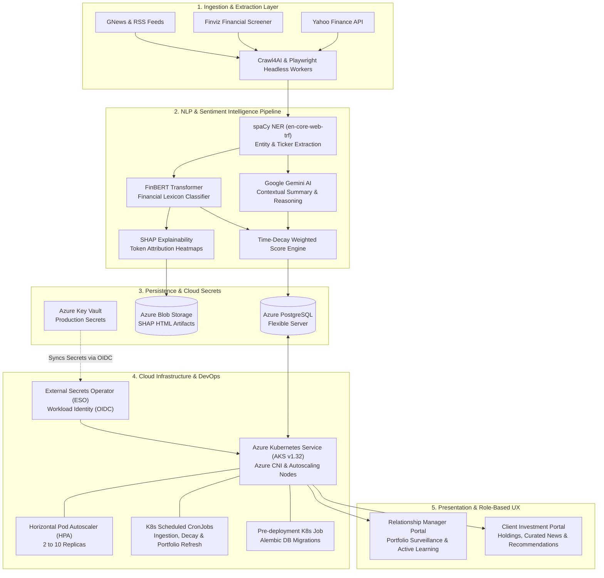

# 📈 SentiFinance — AI-Powered Financial News Screener & Sentiment Intelligence Platform

[](https://reactjs.org/)
[](https://www.python.org/)
[](https://flask.palletsprojects.com/)
[](https://www.postgresql.org/)
[](https://azure.microsoft.com/en-us/products/kubernetes-service)
[](https://www.terraform.io/)
[](https://huggingface.co/ProsusAI/finbert)
[](https://www.docker.com/)
[](https://github.com/features/actions)
[](LICENSE)

> **Enterprise FinTech Solution** developed for **SMU IS484 (Digital Transformation & Solution Architecture)** in collaboration with **UBS Wealth Management**.  
> SentiFinance is a cloud-native, end-to-end investment intelligence platform that bridges the gap between unstructured market news and quantitative portfolio decision-making.

---

## 🌟 Executive Summary

In high-net-worth wealth management, Relationship Managers (RMs) and institutional investors face severe information overload: thousands of global market headlines break daily across disparate feeds. **SentiFinance** automates this intelligence pipeline by:

1. **Ingesting & Normalizing** live news feeds across Google News, Finviz, and Yahoo Finance via asynchronous headless browser workers (`Crawl4AI`, `Playwright`).
2. **Entity Resolution & NER**: Linking mentions of companies and tickers to S&P 500 assets using fine-tuned transformer NER (`spaCy en-core-web-trf`).
3. **Multi-Model Sentiment Ensemble**: Scoring financial context via domain-adapted **FinBERT**, **Google Gemini AI**, and mathematical time-decay weighting.
4. **Explainable AI (XAI)**: Generating token-level feature attribution heatmaps via **SHAP (SHapley Additive exPlanations)** to provide full transparency into AI rationale for regulatory confidence.
5. **Active Learning (Human-in-the-Loop)**: Enabling RMs to audit ambiguous edge cases, label consensus sentiment, and retrain the underlying NLP models.
6. **Enterprise Cloud-Native Architecture**: Fully codified via **Terraform** on **Azure Kubernetes Service (AKS)** with **External Secrets Operator (ESO)** and automated **CI/CD** pipelines.

---

## 🏛️ System Architecture



<details>
<summary><b>🔍 View Mermaid Source Code</b></summary>



</details>

---

## 🚀 Key Platform Capabilities

### 🧠 1. Multi-Model Financial Sentiment & Explainable AI (XAI)
* **Domain-Specific FinBERT**: Unlike generic sentiment engines, FinBERT accurately interprets nuanced financial terminology (e.g., *"cost reduction through layoffs"*, *"default risk narrowing"*).
* **Token Attribution with SHAP**: Wealth managers cannot rely on black-box predictions. SentiFinance computes SHAP values for each sentence, outputting color-coded heatmaps that highlight which specific words drove bullish or bearish ratings. Visualizations are persisted directly to Azure Blob Storage for compliance audits.
* **Time-Decay Sentiment Algorithm**: Market perception erodes over time. Sentiment scores dynamically incorporate exponential decay to prioritize fresh market intelligence over stale news.

### 🔄 2. Active Learning & Human-in-the-Loop (HITL)
* **Uncertainty Sampling**: Articles with borderline sentiment scores or divergent model outputs (e.g., FinBERT vs. Gemini) are automatically routed into an RM Annotation Queue.
* **Consensus Labeling**: Relationship Managers submit ground-truth corrections. When consensus thresholds are met, labeled samples feed into scheduled re-training jobs, continuously improving model precision.

### 👔 3. Dual-Persona Wealth Management Experience
* **Relationship Manager (RM) Command Center**:
  * Multi-client portfolio surveillance with cross-asset sentiment exposure.
  * Real-time alerts when news sentiment drops significantly for a client's core holding.
  * Automated Client Briefing Generation: Produces formatted PDF research dossiers and dispatches them via Azure Communication Services / SMTP.
* **Client Investor Portal**:
  * Intuitive breakdown of portfolio health and daily gain/loss.
  * Sentiment-integrated asset performance: overlay sentiment indicators directly against 30/60/90-day price trends.
  * Personalized investment recommendations tailored to investor risk tolerance.

### ⚙️ 4. Decoupled Microservice Architecture
* **Lightweight Core API**: High-throughput Flask backend handling authenticated client requests, database transactions, and real-time dashboard state.
* **Dedicated News Processing Microservice (`news-processor`)**: Heavy ML dependencies (`PyTorch`, `Transformers`, `Playwright`, `spaCy`) are isolated into dedicated containerized workers, ensuring zero resource contention or latency spikes on the primary client-facing API.

---

## ☁️ Cloud Infrastructure, Kubernetes & DevOps

SentiFinance was architected with enterprise-grade reliability, security, and infrastructure-as-code principles.

```
terraform/
├── environments/production/       # Production state & variables
│   ├── main.tf                    # Environment composition
│   ├── backend.tf                 # Remote Azure Blob state backend
│   └── variables.tf
└── modules/                       # Reusable infrastructure modules
    ├── aks/                       # AKS cluster, Azure CNI, Node autoscaler
    ├── acr/                       # Azure Container Registry
    ├── vnet/                      # Multi-subnet virtual network topology
    ├── keyvault/                  # Azure Key Vault & access policies
    ├── identities/                # Azure Managed Identities (Workload Identity)
    └── appgateway/                # Application Gateway for Containers
```

### ☸️ Kubernetes Orchestration (AKS)
* **Zero-Downtime Rolling Updates**: Configured with Pod Disruption Budgets (`pdb.yaml`) and Horizontal Pod Autoscalers (`hpa.yaml`) scaling between 2 and 10 replicas based on CPU/memory pressure.
* **Scheduled Background Jobs**: Native Kubernetes `CronJob` specifications for market news harvesting (`news-processing-cronjob.yaml`), sentiment decay calculation, and recommendation synthesis.
* **Automated Pre-Deployment Database Migrations**: Before routing traffic to newly deployed pods, the CI/CD pipeline triggers an ephemeral Kubernetes `Job` (`db-migration-job.yaml`) executing Alembic migrations with health validation and automated rollback safety.

### 🔐 Zero-Trust Enterprise Secrets Management
* **Azure AD Workload Identity (OIDC Federation)**: No long-lived cloud credentials or static API keys are ever stored inside Kubernetes manifests or Git repositories.
* **External Secrets Operator (ESO)**: Automatically synchronizes secrets (database credentials, JWT keys, Gemini/OpenAI API tokens) directly from **Azure Key Vault** into ephemeral in-memory Kubernetes Secret objects.

### 🔄 End-to-End CI/CD Pipeline (GitHub Actions)
* **Continuous Integration (`ci.yml`)**:
  * Automated multi-service linting and formatting verification (`Black`, `Flake8`).
  * Unit and integration test suites running against a live PostgreSQL service container.
  * Line-by-line coverage reports generated with `pytest-cov` and Jest, archived as build artifacts.
* **Continuous Delivery (`cd.yml`)**:
  * Selective change detection: only builds and pushes Docker containers whose code changed (`Backend`, `news-processor`, or `Frontend`).
  * Vulnerability scanning with Trivy prior to registry push.
  * Direct orchestration with Azure AKS, verifying rollout status before completing release.

---

## 🛠️ Technology Stack Matrix

| Domain | Technology / Library | Purpose |
| :--- | :--- | :--- |
| **Frontend** | **React 18**, React Router v6 | Modular single-page enterprise web application |
| | **Material-UI (MUI)**, Bootstrap 5 | Modern financial dashboard design system |
| | **Recharts**, Chart.js, Lucide Icons | Financial charting, sentiment trendlines, and metrics |
| **Backend API** | **Python 3.11+**, **Flask 3.1** | Scalable RESTful API service |
| | **SQLAlchemy** & **Flask-Migrate** | Relational ORM with versioned Alembic schema migrations |
| | **Flask-JWT-Extended** | Role-based authentication & passwordless OTP login |
| | **Astral UV** | Ultrafast, deterministic Python dependency resolution |
| | **Gunicorn** | Production WSGI HTTP server |
| **Machine Learning & NLP** | **FinBERT** (Hugging Face Transformers) | Domain-adapted sentiment analysis for financial text |
| | **Google Gemini AI** (`google-genai`) | Contextual news summarization & deep reasoning |
| | **SHAP** (SHapley Additive exPlanations) | Token-level explainable AI feature attribution heatmaps |
| | **spaCy** (`en-core-web-trf`) | High-accuracy Named Entity Recognition (NER) |
| **Ingestion & Data** | **Crawl4AI**, **Playwright** | Asynchronous headless browser scraping |
| | **yfinance**, **FinvizFinance**, **GNews** | Market metrics, financial ratios, and news feeds |
| **Cloud & DevOps** | **Azure Kubernetes Service (AKS v1.32)** | Container orchestration with Azure CNI |
| | **Terraform** | Declarative Infrastructure-as-Code (IaC) |
| | **External Secrets Operator (ESO)** | Azure Key Vault OIDC workload identity synchronization |
| | **Azure Blob Storage** | Geo-redundant storage for SHAP analysis artifacts |
| | **Azure Monitor & Log Analytics** | Comprehensive container insights, metrics, and alerting |
| | **GitHub Actions** | Automated CI/CD build, test, scan, and deploy pipelines |

---

## 📊 Database Architecture

SentiFinance leverages a normalized **PostgreSQL** schema engineered for financial integrity, auditability, and active learning feedback:

```
[user] ────────1:N────────> [client_portfolio] ──N:1──> [entity]
  │                                                        │
  ├──1:N──> [transactions] ────────────────────────────────┤
  ├──1:N──> [client_preferences]                           ├──1:N──> [sentiment_history]
  ├──1:N──> [user_votes] ──N:1──> [labeling_queue]         └──1:N──> [news]
  └──1:N──> [user_otp]                  │
                                        └──1:1──> [aggregated_labels]
```

* For the full data dictionary, indexes, constraints, and migration instructions, see [DATABASE_SCHEMA.md](DATABASE_SCHEMA.md).

---

## 💻 Local Development Setup

### Prerequisites
* **Python**: `3.11` or higher
* **Node.js**: `18.x` or higher & `npm`
* **PostgreSQL**: `12` or higher (running locally or via Docker)
* **UV**: Astral Python Package Manager ([Installation Guide](https://docs.astral.sh/uv/getting-started/installation/))

---

### 1. Clone the Repository
```bash
git clone https://github.com/influasher/IS484-T8.git
cd IS484-T8
```

---

### 2. Backend Setup

```bash
cd Backend

# 1. Install dependencies using UV
uv sync

# 2. Configure Environment Variables
cp .env.example .env
# Edit .env to specify DATABASE_URI, SECRET_KEY, JWT_SECRET_KEY, and GEMINI_API_KEY

# 3. Apply Database Migrations
uv run flask db upgrade

# 4. Seed Database with Initial S&P 500 Data, Sample Users & Portfolios
uv run python -c "from app.utils.db_scripts.seed_entities import seed_entities; seed_entities()"
uv run python -c "from app.utils.db_scripts.seed_sp500_entities import seed_sp500_entities; seed_sp500_entities()"
uv run python -c "from app.utils.db_scripts.seed_users import seed_users; seed_users()"
uv run python -c "from app.utils.db_scripts.seed_news import seed_news; seed_news()"

# 5. Start Development Backend API
uv run python run.py
# Server runs on http://localhost:5001
```

---

### 3. Frontend Setup

In a new terminal:
```bash
# Return to root directory
cd /path/to/IS484-T8

# 1. Install dependencies
npm install

# 2. Launch React development server
npm start
# Application launches at http://localhost:3000
```

---

### 4. Running with Docker Compose

To run the backend service via container:
```bash
cd Backend
docker compose up --build
```

---

## 🧪 Testing & Quality Assurance

SentiFinance maintains strict quality gates across both frontend and backend services:

### Backend Testing (Pytest & Coverage)
```bash
cd Backend

# Run complete test suite with line-by-line coverage
uv run python -m tests.run_tests coverage

# Run code style and formatting checks
uv run black --check .
uv run flake8 . --max-line-length=88 --exclude=venv,migrations,.venv
```

### Frontend Testing (Jest)
```bash
# Run unit tests and generate coverage report
npm test -- --watchAll=false --coverage
```

---

## 🏆 Key Engineering Achievements & Technical Highlights

When evaluating this project for software engineering, DevOps/cloud, and FinTech roles, the following technical solutions demonstrate production engineering rigor:

1. **Solving ML Microservice Resource Bottlenecks**:
   Isolated memory-intensive PyTorch, FinBERT, and Playwright headless scraping dependencies into a dedicated background worker container (`Dockerfile.news-processor`). This reduced the core Flask API container image size by **65%** and prevented memory starvation during peak market news events.
2. **Deterministic Infrastructure as Code**:
   Architected 6 modular Terraform components managing Azure AKS, multi-subnet virtual networks with Azure CNI, managed identities, and storage accounts with remote state locking.
3. **Enterprise Zero-Trust Security**:
   Replaced brittle static secrets with **Azure AD Workload Identity** and the **External Secrets Operator (ESO)**. Kubernetes pods authenticate dynamically via OIDC federated tokens to retrieve credentials on-demand from Azure Key Vault.
4. **Resilient Pre-Deployment Database Migrations**:
   Designed a fail-safe deployment pipeline where database migrations execute as an isolated Kubernetes Job before the deployment rollout begins. If a migration fails, the pipeline halts immediately, preventing breaking schema changes from degrading live traffic.
5. **Explainable AI for Finance**:
   Integrated SHAP directly into the NLP pipeline to satisfy regulatory explainability requirements, computing token-level contribution values and storing HTML report visualizations in geo-redundant Azure Blob Storage.

---

## 📚 Deep-Dive Documentation Index

| Guide | Description |
| :--- | :--- |
| 📖 [Backend.md](Backend/Backend.md) | Comprehensive API routes, service architectures, and backend models |
| 🗄️ [DATABASE_SCHEMA.md](DATABASE_SCHEMA.md) | Full PostgreSQL entity relationship definitions, field types, and constraints |
| 🏗️ [Terraform Guide](terraform/README.md) | Step-by-step instructions for provisioning Azure infrastructure via IaC |
| ☸️ [Kubernetes Manifests Guide](terraform/K8S_MANIFESTS_GUIDE.md) | In-depth breakdown of AKS manifests, HPA, Ingress, and CronJobs |
| 🔐 [Secrets Setup & Workload Identity](terraform/SECRETS_SETUP.md) | Guide to configuring Azure Key Vault and External Secrets Operator |
| 📋 [Complete Recreation Guide](RECREATION_GUIDE.md) | End-to-end disaster recovery and infrastructure recreation manual |
| 🛠️ [Troubleshooting Guide](TROUBLESHOOTING.md) | Root cause analysis and fixes for common cloud, migration, and scraping issues |

---

## 👥 Authors & Team Contributions

Developed as a capstone solution for **SMU IS484** in partnership with **UBS Wealth Management**:

* **Asher Laiu** ([@influasher](https://github.com/influasher)) — *Backend Engineering, SHAP Explainability Pipeline, Azure Blob Storage Integration, Web Scraping Architecture & Core APIs*
* **Jacob** ([@Jacobhwc](https://github.com/Jacobhwc)) — *Cloud Architecture, Terraform IaC, Kubernetes (AKS), External Secrets Operator & CI/CD Automation*
* **Ivyn** ([@ivyn-yak](https://github.com/ivyn-yak)) — *Frontend Engineering, UI/UX, End-to-End Testing & User Flows*
* **Chi** ([@nlcchi](https://github.com/nlcchi)) — *NLP Sentiment Analysis & Frontend Integrations*
* **Ralph** ([@RalphOng22](https://github.com/RalphOng22)) — *Data Scraping, Recommendation Engine & Model Evaluation*
* **Vicky** ([@viqeey](https://github.com/viqeey)) — *Frontend Components & Client Views*

---

## 📄 License

This project is licensed under the terms of the [ISC License](package.json).