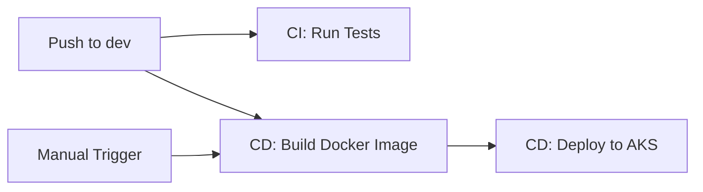

# CI/CD Workflow Configuration for Dev Branch

## Overview

Both CI and CD workflows have been configured to **only work from the `dev` branch**. This ensures that all builds, tests, and deployments use the latest code with lazy loading fixes that exist on `dev`.

## Changes Made

### 1. CI Workflow (`ci.yml`)

**Before:**
```yaml
on:
  push:
    branches: [ main, dev ]
```

**After:**
```yaml
on:
  push:
    branches: [ dev ]  # Only run CI on dev branch
```

**Impact:**
- ✅ CI only runs when pushing to `dev`
- ✅ No more CI runs on `main` (which is outdated)
- ✅ Prevents confusion about which branch is being tested

### 2. CD Workflow (`cd.yml`)

**Changes:**

#### a) Removed workflow_run trigger
**Before:**
```yaml
on:
  workflow_dispatch: ...
  workflow_run:
    workflows:
      - "Basic CI Pipeline"
    types:
      - completed
  push:
    branches:
      - dev
```

**After:**
```yaml
on:
  workflow_dispatch: ...
  push:
    branches:
      - dev  # Only deploy from dev branch
```

**Why:** The `workflow_run` trigger was listening for CI completion on any branch (including `main`), which would build Docker images from outdated code.

#### b) Updated job condition
**Before:**
```yaml
if: ${{ (github.event_name == 'workflow_run' && github.event.workflow_run.conclusion == 'success') || (github.event_name == 'push' && github.ref == 'refs/heads/dev') || github.event_name == 'workflow_dispatch' }}
```

**After:**
```yaml
if: ${{ (github.event_name == 'push' && github.ref == 'refs/heads/dev') || github.event_name == 'workflow_dispatch' }}
```

**Why:** Removed workflow_run condition since we're no longer using that trigger.

#### c) Explicit branch checkout
**Before:**
```yaml
- name: Checkout code
  uses: actions/checkout@v4
  with:
    fetch-depth: 0
```

**After:**
```yaml
- name: Checkout code
  uses: actions/checkout@v4
  with:
    ref: dev  # Explicitly checkout dev branch
    fetch-depth: 0
```

**Why:** Ensures CD always builds from `dev`, even if manually triggered or triggered by workflow_dispatch.

## Current Workflow Behavior

### CI Workflow (ci.yml)
1. ✅ **Trigger:** Push to `dev` branch
2. ✅ **Runs:** Backend tests + Frontend tests
3. ✅ **Branch:** Always uses `dev` code

### CD Workflow (cd.yml)
1. ✅ **Trigger:** Push to `dev` OR manual workflow_dispatch
2. ✅ **Branch:** Always checks out `dev` explicitly
3. ✅ **Builds:** Docker image from `dev` code (with lazy loading)
4. ✅ **Deploys:** To AKS production environment

## Deployment Flow



**Note:** CI and CD are now independent. CD triggers directly on push, not after CI completes.

## Verification Steps

### 1. Verify CI only runs on dev
```bash
# Push to dev
git push origin dev
# ✅ CI should run

# Push to main (if you do this later)
git push origin main
# ✅ CI should NOT run
```

### 2. Verify CD builds from dev
```bash
# Check the workflow run logs
gh run view --log | grep "ref: dev"
# Should show: uses: actions/checkout@v4 with ref: dev

# Check Docker image SHA matches dev commits
az acr repository show-tags \
  --name sentifinancetwo \
  --repository sentifinance-backend \
  --orderby time_desc \
  --detail | grep -A5 latest
```

### 3. Verify lazy loading is in the image
```bash
# After successful deployment, check pod logs
kubectl logs -n sentifinance -l app=sentifinance-backend --tail=100 | grep "lazy"

# Should see on first sentiment analysis request:
# "Loading FinBERT model on first use..."
```

## Triggering Deployments

### Automatic (Recommended)
```bash
# Just push to dev
git add .
git commit -m "your changes"
git push origin dev

# Both CI and CD will run automatically
```

### Manual Deployment
1. Go to: https://github.com/influasher/IS484-T8/actions
2. Click "Deploy to Azure Kubernetes (K8s)"
3. Click "Run workflow"
4. Select options:
   - **Branch:** `dev` (should be default)
   - **skip_build:** false (to rebuild) or true (to reuse existing)
   - **image_tag:** latest or specific SHA
   - **environment:** production
5. Click "Run workflow"

**Important:** Manual workflow will still checkout `dev` branch due to explicit `ref: dev` in checkout step.

## Benefits of This Configuration

1. ✅ **Consistency:** All images built from same branch (`dev`)
2. ✅ **Includes fixes:** Every deployment has lazy loading + optimizations
3. ✅ **No confusion:** Can't accidentally deploy old `main` code
4. ✅ **Fast iteration:** Push to `dev` → automatic test + deploy
5. ✅ **Safety:** `main` branch preserved as stable backup if needed

## When to Merge to Main

Merge `dev` → `main` when:
- ✅ Features are stable and tested in production (via `dev` deployments)
- ✅ Ready for official release/version tag
- ✅ Want to update documentation that references `main`

**Note:** Since workflows don't run on `main`, merging is purely for version control and branch management.

## Rollback Strategy

If a `dev` deployment breaks production:

### Option 1: Revert commit and redeploy
```bash
git revert HEAD
git push origin dev
# CD will automatically deploy the reverted version
```

### Option 2: Manual deploy previous image
```bash
# Find good image SHA
az acr repository show-tags \
  --name sentifinancetwo \
  --repository sentifinance-backend \
  --orderby time_desc

# Deploy via workflow_dispatch
# - skip_build: true
# - image_tag: <good_sha_here>
```

### Option 3: Kubectl rollback
```bash
# Immediate rollback to previous deployment
kubectl rollout undo deployment/sentifinance-backend -n sentifinance
kubectl rollout status deployment/sentifinance-backend -n sentifinance
```

## Troubleshooting

### Issue: "Workflow didn't trigger on push to dev"
**Check:**
```bash
# Verify you're on dev branch
git branch --show-current

# Verify remote is updated
git log origin/dev --oneline -5
```

**Fix:** Push again with `--force-with-lease` if needed

### Issue: "Docker image still has old code"
**Check:**
```bash
# View latest workflow run
gh run view --log | grep "Checkout code" -A 3

# Should show: ref: dev
```

**Fix:** If missing, manually trigger workflow to force rebuild

### Issue: "Pods still showing OOMKilled"
**Check:**
```bash
# Verify lazy loading in deployed image
kubectl exec -n sentifinance deployment/sentifinance-backend -- \
  grep -n "def finbert_pipeline" /app/app/services/sentiment_analysis.py

# Should show @property decorator above it
```

**Fix:** Commit lazy loading code to `dev` and redeploy

## Configuration Summary

| Setting | Value | Location |
|---------|-------|----------|
| CI Branch Filter | `dev` only | `.github/workflows/ci.yml:5` |
| CD Branch Filter | `dev` only | `.github/workflows/cd.yml:28` |
| CD Checkout Branch | `dev` (explicit) | `.github/workflows/cd.yml:48` |
| CD Triggers | push to dev, workflow_dispatch | `.github/workflows/cd.yml:3-28` |
| Removed Triggers | workflow_run (CI completion) | N/A |

## Next Steps

1. ✅ **Commit these workflow changes**
   ```bash
   git add .github/workflows/ci.yml .github/workflows/cd.yml
   git commit -m "fix: configure CI/CD to only use dev branch"
   git push origin dev
   ```

2. ✅ **Watch deployment succeed**
   ```bash
   gh run watch
   ```

3. ✅ **Verify pods are healthy**
   ```bash
   kubectl get pods -n sentifinance
   kubectl logs -n sentifinance -l app=sentifinance-backend
   ```

4. ✅ **Test application**
   ```bash
   SERVICE_IP=$(kubectl get service sentifinance-service -n sentifinance -o jsonpath='{.status.loadBalancer.ingress[0].ip}')
   curl http://$SERVICE_IP/
   ```

5. 🔄 **Later: Merge to main (optional)**
   ```bash
   git checkout main
   git merge dev
   git push origin main
   # This won't trigger any workflows, just updates main branch
   ```

---

**Last Updated:** October 23, 2025  
**Status:** ✅ Active Configuration  
**Branch Strategy:** Dev-only deployment (main preserved as backup)
